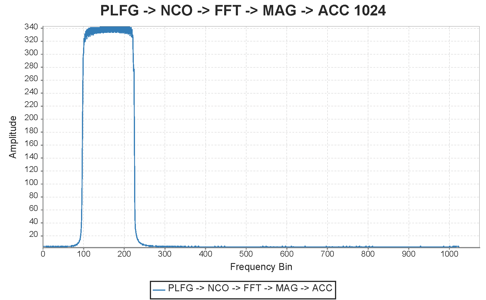
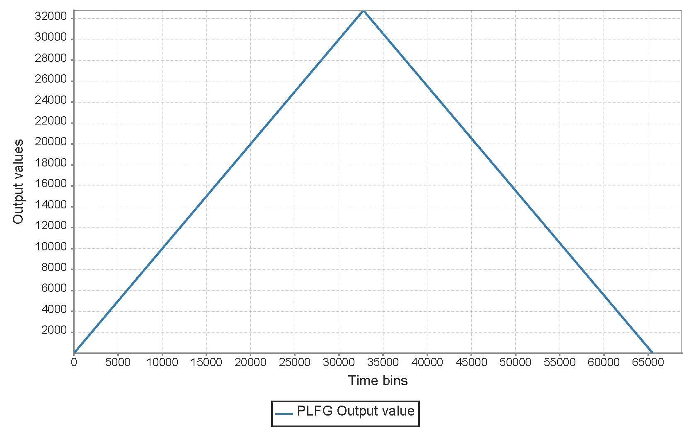
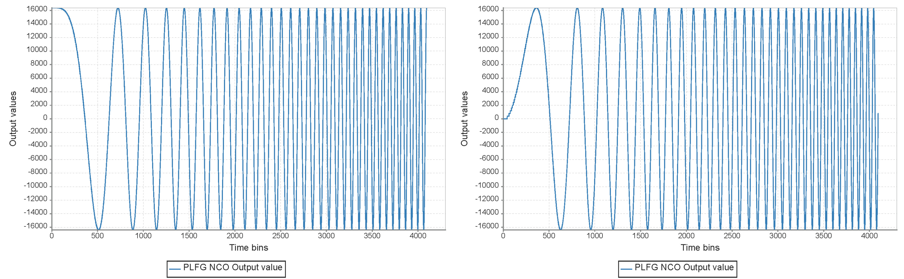
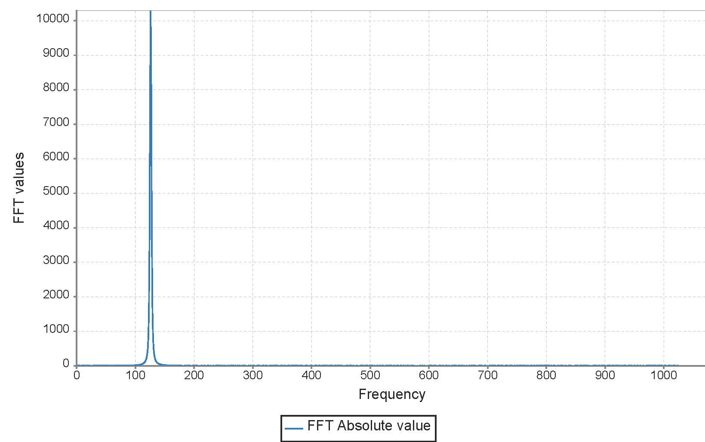

SpectrometerVanilla Generator designed in Chisel HDL
========================================================

## Overview
SpectrometerVanilla is a generator of parametrizable streaming chains containing exactly one of each of the following submodules:
 - Piecewise Linear Function Generator [PLFG](https://github.com/milovanovic/plfg)
 - Numerically Controlled Oscillator [NCO](https://github.com/milovanovic/nco)
 - Single-path Delay Feedback Fast Fourier Transform accelerator [SDF-FFT](https://github.com/milovanovic/sdf-fft)
 - Logarithm-Magnitude circuitry [LogMagMux](https://github.com/milovanovic/logMagMux)
 - Spectral Accumulator [accumulator](https://github.com/milovanovic/accumulator)

## Example
In this repository, an example for the SpectrometerVanilla generated chain is provided along with the plots of every submodule's output signals. The main idea of the example is to accumulate FFT windows generated by storing multiple adjacent (in terms of frequency) chirp sinusoidal signals. Those signals are produced using numerically controlled oscillator by driving its phase increment input with one period of a large sawtooth-type signal. The plot of the accumulated FFT windows is provided below:

The PLFG submodule is configured so that the one chirp consisting of 8 segments is produced on the outuput. The first three segments have an increment value of +1 and a length of 8192 samples. The fourth segment also has an increment value of +1, but its length is 8448 (this 'irregularity' is made to avoid overlapping of windows created by rising and falling parts of the sawtooth-type signal). The first four segments create the rising part of the sawtooth-type signal on the output and each of them have enough number of samples for eight 1024-point FFT windows (with 256-sample spare from the last segment). The next four segments and at the same time the last four segments are all the same and they have a negative increment value of -1 and a length of 8192 samples each thus creating the falling part of the sawtooth-type signal on the output. Each of them also have enough number of samples for eight 1024-point FFT windows. Output of the PLFG submodule is provided below:

The NCO submodule has a look-up table consisting of 64 samples (total of 512 samples in one period of signal) and phase width of 18 bits meaning that the phase is truncated to an eight-bit value. Phase increment input is driven by output signals of the PLFG submodule. The NCO output samples for the first four FFT windows are shown below (cosine values on the left and sine values on the right):

The FFT submodule receives samples from the NCO submodule. After every 1024 input samples it produces appropriate 1024 output FFT values, real and imaginary. Magnitude values of the 32nd of the FFT windows are shown below:

 
Magnitude FFT values are calculated by the LogMagMux submodule and they are accumulated and stored in the accumulator submodule. There are in total 64 FFT windows with a peak like the one shown on the plot above (but on a different frequency bin) stored in the accumulator. These FFT windows added up create the final output shown in the first plot of this document.
