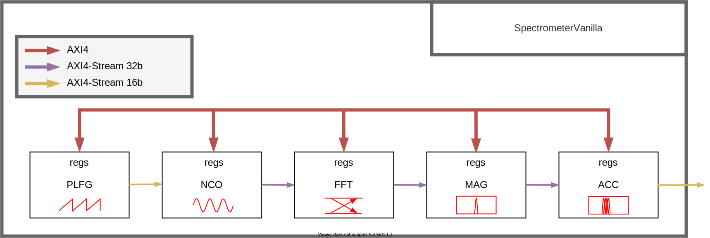

Digital Spectrometer Generator designed in Chisel HDL
======================================================
[](https://travis-ci.org/milovanovic/spectrometer)

## Overview

This repository contains digital spectrometer generator designed in [Chisel](http://www.chisel-lang.org) hardware design language. Two major  modules `SpectrometerVanilla` and `SpectrometerTest`  accompanied with appropriate tests are explained in the text below. 

## SpectrometerVanilla

Block diagram of the `SpectrometerVanilla`module (check `SpectrometerVanilla.scala` inside `src/main/scala` ) is given bellow. 



`SpectrometerVanilla`consists of the following Chisel generators (available inside `generators` directory and organized as submodules):
 * Piecewise Linear Function Generator [PLFG](https://github.com/milovanovic/plfg)
 * Numerically Controlled Oscillator [NCO](https://github.com/milovanovic/nco)
 * Single-path Delay Feedback Fast Fourier Transform accelerator [SDF-FFT](https://github.com/milovanovic/sdf-fft)
 * Logarithm-Magnitude circuitry [LogMagMux](https://github.com/milovanovic/logMagMux)
 * Spectral Accumulator [accumulator](https://github.com/milovanovic/accumulator)

Parameters and address space of the each block from presented diagram can be customised inside `SpectrometerVanillaParameters` case class.

## SpectrometerTest

Block diagram of the `SpectrometerTest`module (check `SpectrometerTest.scala` inside `src/main/scala` ) is given bellow. 


Despite generators mentioned in the previous paragraph, this system comprises following blocks:
* UART transmitter and UART receiver  written in Chisel3 (available inside directory `generators/uart`) and mostly taken from [sifive-blocks](https://github.com/sifive/sifive-blocks/tree/master/src/main/scala/devices/uart ) .
* A lot of AXI4-stream splitters  (check `generators/splitter`) 
* A lot of AXI4-stream multiplexers, AXI4-stream adapters and AXI4/AXI4-stream buffers are extensively used which together with AXI4-stream splitters make easier to test whole system. Those modules are available inside [rocket](https://github.com/ucb-bar/dsptools/tree/master/rocket/src/main/scala/amba/axi4stream) directory of the dsptools library.
* Blocks `always_ready`, `all_ones` and `all_zeros`which are self-explanatory.

Parameters for all generators, as well as address space for the  each module separately, can be customized inside `SpectrometerTestParameters` class.

## Prerequisites

The following software packages should be installed prior to running this project:
* [sbt](http://www.scala-sbt.org)
* [Verilator](http://www.veripool.org/wiki/verilator)

## Setup

### Generate verilog

Clone this repository and  switch directory:
```
git clone https://github.com/milovanovic/spectrometer.git
cd spectrometer
```
Both `SpectrometerTest` and `SpectrometerVanilla` scala files contains object used for verilog generation:
```
// replace ModuleName with SpectrometerVanilla or SpectrometerTest

object ModuleNameApp extends App {
  implicit val p: Parameters = Parameters.empty
  // define parameters of the spectrometer
  val params = ... 
  
  val standaloneModule = LazyModule(new ModuleName(params) with ModuleNamePins)
  
  // generate verilog code of the standaloneModule with parameters described inside params
  chisel3.Driver.execute(args,()=>new ModuleName(params))
  
  // or use new chisel3 command which uses *ChiselStage
  (new chisel3.stage.ChiselStage).execute(
    Array("-X", "verilog"),
    Seq(ChiselGeneratorAnnotation(() => new ModuleName(params))))
}
```
**Note**: *[ChiselStage](https://www.chisel-lang.org/api/3.3.2/chisel3/stage/ChiselStage.html) 
To run specific `App`  and generate verilog, type in  console next command:
```
sbt "runMain spectrometer.ModuleNameApp"
```
By selecting specific options inside chisel3 driver or stage, user can customize exact directory where verilog code is going to be generated. 

### Running tests
For running  tests, clone this repository, switch directory and run all tests:
```
git clone https://github.com/milovanovic/spectrometer.git
cd spectrometer
sbt test
```
### Travis
Each new commit execute `sbt "testOnly spectrometer.SpectrometerTestSpec"` command inside Travis CI.

## Tests
Tests for the digital spectrometer are loacated  in `src/test/scala` directory. These tests, as well as the other structures needed for running them, are defined in the following files:
*  `SpectrometerTestSpec.scala` and `SpectrometerVanillaSpec.scala` - various test cases can be find for both `SpectrometerVanilla` and `SpectrometerTest` modules.
*    A lot of testers defined in `*SpectrometerTesters.scala` files which content is more or less self-explanatory by the name of the scala file which contains appropriate tester.
*  `SpectrometerTesterUtils.scala` -  contains a lot of useful helper functions for testers such as `getTone`,  `checkFFTerror`,  axi4 stream format functions, plot functions etc.

For proper register initialization and streaming transactions  inside tests, [AXI4MasterModel](https://github.com/ucb-bar/dsptools/blob/master/rocket/src/main/scala/amba/axi4stream) and  [AXI4StreamModel](https://github.com/ucb-bar/dsptools/blob/master/rocket/src/main/scala/amba/axi4/AXI4MasterModel.scala) are extensively used, both available as a part of `dsptools` library.
